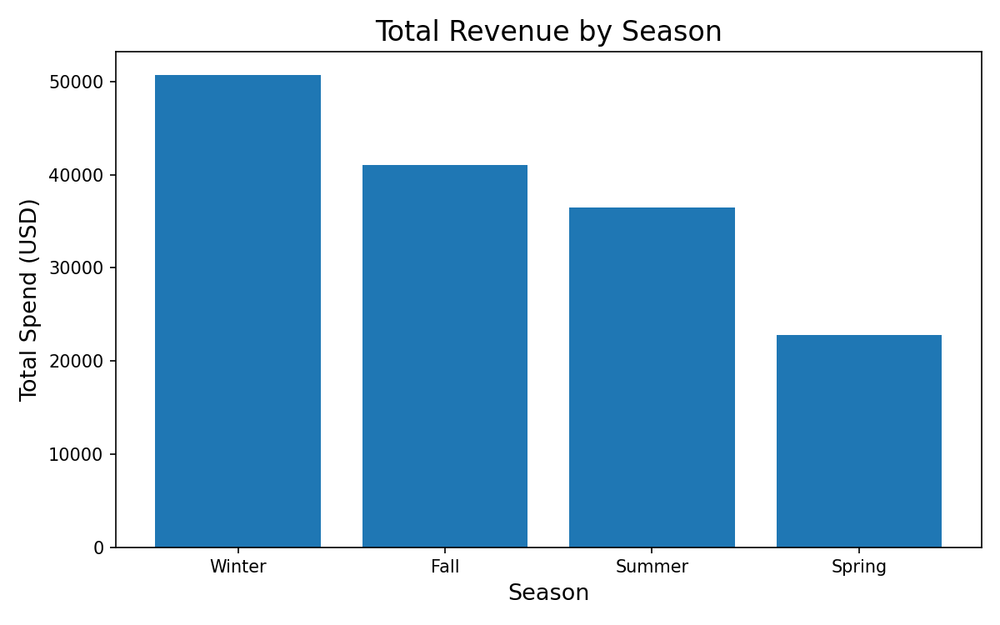

# shopping-behavior
Statistical analysis of customer shopping data using Python, including pandas, groupby operations, pivot tables, descriptive statistics and data visualizations.

## Description
This project analyzes customer shopping behavior across seasons, genders, and loyalty levels. Focus areas include purchase frequency, promo code effectiveness, as well as product and color preferences. The goal is to identify trends such as seasonality of shoppers, which demographics buy the most, and which market outreach strategies can be applied to maximize purchases.

## Quick Demo


Winter is the season with the most total revenue, followed by Fall, Summer and Spring.

## Setup and Run
1. Clone this repository:
   ```bash
   git clone https://github.com/amirbenston/Shopping_Dataflash.git
   cd shopping-behavior
   ```

2. Make sure the data files are in the `data/raw/` folder:
   - `data/raw/shopping.csv`

3. (Optional) Create and activate a virtual environment.

4. Install dependencies:
   ```bash
   pip install matplotlib
   pip install pandas
   ```

5. Open and run the analysis notebook:
   ```bash
   jupyter notebook explore.ipynb
   ```
   or open `explore.ipynb` directly in VS Code and run all cells.

6. Review the output: 
- Descriptive statistics and breakdown of purchases by season, gender, and color in the notebook.
- Total revenue by season clearly displayed as a bar graph.
- Interpretation of findings after tables and graphs in the `explore.ipynb` as well as highlights below.

## Key Findings

## Spending by gender
- Total spend:
  - Male customers: 76,032  
  - Female customers: 73,620  
- Number of purchases:
  - Male customers: 1,971  
  - Female customers: 1,984  
- Average spend per purchase:
  - Male customers: 38.6  
  - Female customers: 38.9  

Spending is nearly even amongst genders, it makes sense to target both groups with advertising and promotions.


## Seasonality and purchase frequency
- Total revenue by season:
  - Winter: 50,681  
  - Fall: 41,004  

Winter and fall are the strongest seasons for revenue, so promotions and marketing should take advantage of increased activity during these periods.

Winter is the season with the highest purchase counts across all genders:
  - Female: 655 purchases  
  - Male: 651 purchases  
  - Non‑binary: 15 purchases  

This supports investing in winter‑focused campaigns, especially around top winter items such as black leggings.

## Loyal customers (10+ purchases)
- Among customers with 10 or more purchases, females slightly outnumber males:
  - Female loyal customers: 449  
  - Male loyal customers: 444  

Loyalty is almost evenly split between male and female customers, suggesting retention efforts should continue to target both groups.


  ## Most Popular Color By Season:
  - Fall: Brown (117)
  - Spring: Baby Blue (83)
  - Summer: Lavender (120)
  - Winter: Black (155)

  ## Most Popular Clothing Item By Season:
  - Fall: Socks(87)
  - Spring: Running Shoes(106)
  - Summer: Shorts(177)
  - Winter: Leggings(157)

 ## Effect Of Promo Codes On Order Value:
 - No Promo Code: average order value 30.17
 - With Promo Code: average order value 50.02
 
 Promotions appear effective at increasing revenue per order.


  ## When do users leave a review? 
 - Most purchases are never reviewed, and the dataset does not include review timestamps.
 - Reviews are more common amongst monthly and quarterly shoppers, suggesting there is a time gap between purchase and review, typically a month or longer.


